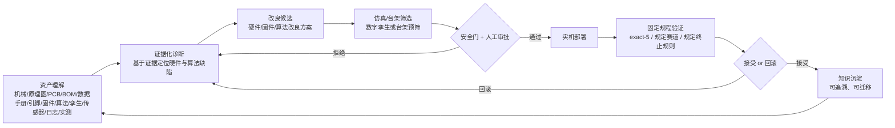
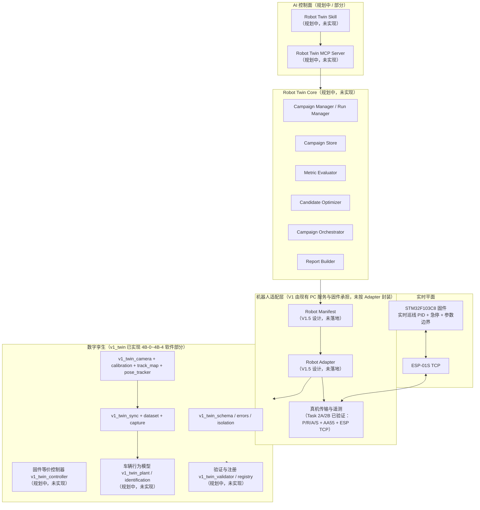
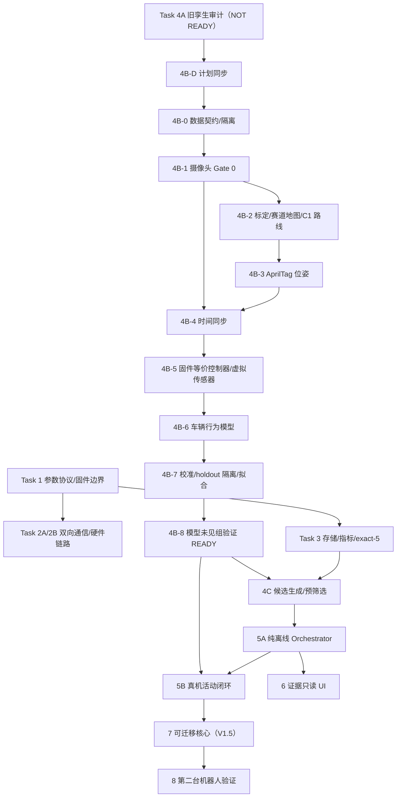

# Robot Twin AI — 完整计划说明书 v2.6

> **唯一项目总入口。** 任何新进入本项目的代理（Codex / Claude Code / DeepSeek），请在执行任何动作前只读本文件；需要细节时再按 §17 的引用清单打开下级 spec / plan / handoff / 证据。
>
> 本文件是**计划与状态说明书**，不是执行任务卡。本文件自身不授权任何硬件动作、不授权 Git 写操作、不修改任何产品代码。

---

## 1. 文档身份与权威规则

| 字段 | 值 |
|---|---|
| 文档标题 | Robot Twin AI — 完整计划说明书 v2.6 |
| 版本 | v2.6 |
| 快照日期 | 2026-08-05 |
| 状态 | 现行总入口（取代任何更早的"总纲"表述；早前各 spec/plan/handoff 降级为下级证据） |
| 适用范围 | 本项目全部研发工作；所有代理会话进入项目后按本文件恢复背景与定位 |
| 作者 | 本文档任务代理（2026-08-02，纯文档任务） |
| 更新者 | 仅允许通过 §17.4 的变更规则更新；任何代理不得擅自改写历史事实 |

### 1.1 文档层级

```
本文件（总入口，计划 + 状态 + 治理）
├── docs/superpowers/plans/    ← 具体执行计划（一份计划对应一个/一组 Task）
├── docs/superpowers/specs/    ← 设计规格（先于计划存在，是计划的依据）
├── docs/superpowers/*.md      ← 历史验收报告（task1/task2a 等）
├── .embeddedskills/build/     ← 各 Task 的执行证据、handoff、指标、日志
└── simulation/digital_twin/   ← 产品代码（数字孪生 / PC 闭环服务）
```

### 1.2 冲突时的优先级与变更记录

1. **本文件是状态与计划权威**：当旧 spec/plan 的陈述与本文件冲突时，以本文件为准，并在本文件 §17.3「发现的过期陈述」中登记。
2. **同一 Task 的 plan 先于 spec 执行**：spec 定义"为什么/是什么"，plan 定义"怎么逐步做"。发现两者冲突时，先记录，不悄悄改写历史。
3. **历史证据不可改**：`.embeddedskills/build/*` 下的 handoff、metrics、日志是已发生事实的记录。返工只能**新增**证据目录并在新 handoff 中说明差异，不得覆盖旧结论（例外：证据文件本身在返工任务中被显式指定重新生成，且旧值以副本/前缀保留——见 4B-2 C1 返工对 `metrics_pre_rework_*` 的处理）。
4. **变更记录**：本文件每次更新在 §17.4 追加条目：日期、改动者、改动内容、受影响章节。

---

## 2. 一页项目总览

- **一句话使命**：让 AI 深度参与机器人研发迭代——关联并理解从原理图、BOM、数据手册、引脚、固件到数字孪生、传感器、测试日志与实测数据的全部资产，基于证据诊断硬件与算法缺陷，提出改良候选，先在数字孪生/台架筛选，经安全门与人工审批后部署到真机，按固定规程验证，失败自动回滚，并把结果沉淀为可追溯、可迁移的知识供下一轮研发使用。
- **核心研究命题**：验证在明确约束下，AI 能否完成机器人研发链路中的连续迭代，并让后一轮真实机器人表现优于前一轮。项目研究对象是“AI 参与研发的闭环过程”，不是 PID 调参器本身。
- **当前 V1 在验证什么**：用固定巡线小车和受限、有界、离散、版本化的运行时 PID 参数（Kp/Ki/Kd/速度上限）作为第一种候选载荷，打通“基线 → 候选生成 → 数字孪生预筛选 → 真机部署 → 重复测试 → 接受或回滚 → 真实反馈”的最小链路。**小车和 PID 都是最小技术验证载体，不是最终目标。**
- **当前首个真实研发问题**：高速运行，尤其是高速急弯时的丢线和抖动。该现象是当前切入场景；根因仍需通过重复真机实验和证据分析确认，不能预先归因于传感器、PID 或某一个硬件。
- **最终要建设什么**：跨机器人的可迁移研发平台：Robot Manifest + Adapter + Twin Core + MCP Server + Skill，支撑多类机器人（轮式 → 机械臂/无人机/四足）的“资产理解 → 证据化诊断 → 算法/固件/硬件候选 → 仿真筛选 → 安全审批 → 实机验证 → 知识沉淀”。
- **当前最大阻塞**：**输入证据链存在两个独立阻塞**——
  1. **4B-1 摄像头 Gate 0 重新验收失败**：DroidCam WiFi 1280×720 丢帧率 12.2% > 5%（2026-08-02 新鲜 600s 重验 FAIL，见 §6）——根因是**无线视频流稳定性不满足门限**。
  2. **4B-2 真实赛道图 `track_bare.png` 被画面底边裁切**（`BLOCKED_INPUT_CROPPED`）——这是**拍摄构图/覆盖范围问题**（摄像头画面未完整覆盖赛道），**不是无线流丢帧导致的**。

  两者是**独立阻塞、根因不同**，须分别解决：4B-1 要靠新的 USB 摄像头提供稳定视频流；4B-2 要靠新的 USB 摄像头完整覆盖赛道后重新采集、标定、验收。不得合并为一个根因。
- **最近下一步**：等待新 USB 摄像头到货。到货前只能做纯离线工作（文档/计划/离线算法/固件可编译验证，见 §8.4）；到货后按 §8.4 顺序：安装/确认 USB 摄像头并**重跑 4B-1 Gate 0** → 重采完整赛道俯视图 → **重标定** → 重跑路线提取并**重验收 4B-2**（`input_cropped=false`、`status=PASS`）→ 重验 4B-3 静态位姿、跑 **4B-4 真机同步 Gate** → 按 DAG 解锁 4B-5~4B-8、4C、5A、5B。

> 本次 v2.6 只澄清项目命题、V1 角色和人工边界，不改写历史技术证据或任务验收结论。涉及最新技术状态时，以 `docs/agent-context/CURRENT_STATUS.md` 和对应 handoff 为准。

### 2.1 项目真正要做什么

本项目最终要建立的是一个以数字孪生为基础的机器人研发闭环，而不是一个单独的自动调参工具。目标链路为：

`真实机器人表现 → AI 发现问题/提出假设 → 算法、固件或硬件/PCB 候选 → 数字孪生虚拟测试 → 候选落到真实机器人 → 真机验证 → 真实反馈修正数字孪生和下一轮方案`

其中：

- **AI 的职责**：根据资产、实验数据和历史结果提出问题解释与候选方案，进行虚拟测试和候选筛选，并用真实反馈改变下一轮设计；不能把 AI 的职责缩减为调用一个 PID 优化器。
- **数字孪生的角色**：先承担“减少真实试错、帮助预测候选效果”的基础设施职责；它不要求一开始完美，但必须通过真实反馈不断校准，且不能用仿真结果冒充真实改进。
- **人工的最终边界**：在长期目标中，人工可以负责打板、焊接、装配、上电和安全监管，并查看最终数据；人工不应替 AI 手工修改候选、替换设计或主观指定哪一版获胜。当前 V1 仍然需要人工授权和在场执行真机操作，这不等于已经实现无人参与。
- **最硬的成功判据**：在预先固定且可重复的真实测试条件下，第二轮 AI 输出实际落地后的表现稳定优于第一轮，并且两轮候选、版本、测试过程和结果均可追溯。一次偶然变好不能单独证明闭环有效。
- **能力边界**：V1 只允许受限运行时 PID 参数；AI 修改核心控制算法、固件以及设计电路/PCB 属于后续阶段的目标，不能把规划中的能力写成当前已验证事实。

---

## 3. 概念和边界

| 概念 | 定义 | 当前状态 | 与相邻概念的差别 |
|---|---|---|---|
| **终极平台愿景** | AI 参与从硬件资产理解到硬件/固件/算法改良的完整研发闭环（§4） | 规划中；V1 只是其第一步 | 不是任何当前 Task 可交付；任何"已完成终极目标"的说法都是错误 |
| **V1 技术闭环验证** | 以固定赛道和限定运行时 PID 参数作为第一种候选载荷，验证“数字孪生预筛 → 真机验证 → 真实反馈”的最小研发闭环 | 进行中（Task 1/2/3 完成，4B 中途被输入阻塞） | 只允许**运行时 PID 参数**；禁止改源码、烧录、裸 PWM |
| **V1.5 可迁移封装** | 把 V1 已验证的闭环能力整理成 Robot Manifest + Adapter + Core + MCP + Skill | 设计完成（spec/plan 已写），实现未开始（须 V1 全部完成后提取） | 目标是"第二台机器人不修改 Core"，不是 V1 前重构 |
| **商业产品验证** | 面向用户的多机器人研发平台产品化 | 未定义商业场景，仅"产品化候选"里程碑 | 不属于当前技术任务范围；不能把技术闭环描述成产品 |
| **数字孪生** | 与真机有标定/校准关系的、可预测的真机行为模型 | V1 用 `v1_twin` 最小可信二维孪生；旧孪生（control_sandbox 等）被 Task 4A 判 NOT READY | 核心是**预测可信**，不是可视化 |
| **可视化 / 3D 渲染** | 展示层（如 main_3d.py、web_showcase） | 仅演示/观察层，不参与 PID 优化 | 3D 动画 ≠ 性能提升证据 |
| **仿真模型** | 任何在 PC 上运行的模型（含旧合成标定模型） | 旧标定模型为合成数据、R²=1.0 不可信；v1_twin 需通过 G1-G8 可信门 | 仿真通过 ≠ 真机证明 |
| **真机遥测** | 真实小车经 ESP/TCP 上传的传感器/PWM/误差/时间数据 | Task 2B 已验证链路（有限范围）；完整真机运行数据尚未获得 | 唯一可支撑"真机证明"的证据等级 |

**安全边界（必须始终保留）**：当前 V1 只允许有界、离散、版本化的运行时 PID 参数和速度上限。**不得**把 V1 描述成已能自主修改硬件、改写固件、自动烧录或发送裸电机命令。上述能力只存在于 §7 Stage 3+ 的规划，且每步都要安全门与人工审批。

---

## 4. 终极研发闭环

> **本节为长期愿景 / 规划判断**（源自原始 PDF 与纲领，见 §17.1），**不是当前已验证事实**。当前已验证事实见 §6；从愿景到实现的每一阶段都要过 §7 的安全门与人工审批，任何"已完成终极目标"的说法都是错误的。

```
资产理解 → 证据化诊断 → 改良候选 → 仿真/台架筛选 → 安全与人工审批
  → 实机部署 → 固定规程验证 → 接受或回滚 → 知识沉淀 → 下一轮
```



### 4.1 各环节定义

| 环节 | 输入 | 输出 | 证据 | 禁止越权事项 |
|---|---|---|---|---|
| **资产理解** | 机械结构、原理图、PCB、BOM、数据手册、引脚定义、固件源码、控制算法、数字孪生、传感器、测试日志、实测数据 | 结构化的资产理解（机器人 Manifest、参数 Schema、遥测 Schema、安全策略、硬件知识条目） | 读到的原始文件清单 + 知识条目；对无法理解/无法验证的部分标 INSUFFICIENT EVIDENCE | 不得把"看到文件"说成"理解硬件"；不得凭文件名/外观猜测硬件能力 |
| **证据化诊断** | 真机遥测、日志、复现实验 | 有证据支撑的缺陷假设与根因分析（区分 VERIFIED / INFERENCE / INSUFFICIENT） | 复现步骤、日志、数据对比（如 Task 4A 的数据泄漏定位） | 不得无证据断言；不得用单次观测代替重复测试 |
| **改良候选** | 诊断结论 + 固件声明的参数边界/能力 | 受边界约束的候选（V1 为 PID 参数包；未来为固件/硬件改版提案） | 候选 rationale、范围与步进声明 | V1 不得提出越过"运行时 PID 参数"范围的候选；不得自动改源码 |
| **仿真/台架筛选** | 冻结的数字孪生（通过 G1-G8）或台架 | 排序后的候选与模型预测、置信度 | 模型版本、预测指标、置信度、筛选结论 | 模型 NOT READY 时不得预筛选；不得用可视化/动画代替预测 |
| **安全与人工审批** | 候选包 + 安全影响评估 | 通过/拒绝决定 | 审批记录（§10 授权矩阵） | AI 不得自我审批；旧授权不可沿用 |
| **实机部署** | 审批通过的候选 | 带版本号/校验和/活动 ID 的参数包 + ACK | 固件 ACK、实际生效值、审计记录 | 部署 = 运行时命令，**不是烧录**；不得绕过参数范围/版本/校验和 |
| **固定规程验证** | 候选参数 + 固定赛道 + 固定测试规程 | 每次运行的真实遥测与终止原因 | run_id 目录下的原始遥测、指标、终止原因 | 不得改测试规程、不得删除失败运行、不得补全缺失测试 |
| **接受或回滚** | 基线指标 + 候选指标 | 接受 / 拒绝 + 回滚到基线 | 指标对比、接受或拒绝理由、回滚记录 | 不满足全部条件时不得接受；"全部拒绝"只能证明闭环本身 |
| **知识沉淀** | 各环节记录 | 可追溯、可迁移的知识（campaign 报告、模型版本、参数版本、经验条目） | 报告、版本注册表、可回放数据 | 不得把低等级证据沉淀为真机结论；不得伪造版本 |
| **下一轮** | 沉淀的知识 | 新一轮的资产理解输入 | — | — |

---

## 5. 平台总体架构

分层原则（V1.5 设计）：**实时控制留在机器人端**（MCU/实时控制器负责 PID、电机输出、急停、看门狗）；**AI 只通过受限能力操作机器人**；**MCP 是控制面不是实时数据面**；**Skill 规定流程，代码保证约束**；**所有接口版本化并可验证**。



### 5.1 各组件实现状态

| 组件 | 状态 | 说明 / 证据 |
|---|---|---|
| **Robot Asset / Hardware Knowledge Layer** | 规划中 | 关联原理图/PCB/BOM/数据手册/固件等；暂无系统化实现（V1 仅以 spec/plan/handoff 文档承载） |
| **Robot Manifest 与 Robot Adapter** | 设计完成，未实现 | V1.5 spec/plan（2026-07-29）定义了 `robot_manifest.yaml`、`RobotAdapter` 接口、Schema、SafetyPolicy |
| **Robot Twin Core** | 设计完成，未实现 | V1.5 计划 Task 3；V1 现有 `campaign_store.py`、`campaign_metrics.py`、`runtime_protocol.py` 为可复用基础（Task 4A 判为保留） |
| **数字孪生与模型校准** | 部分实现 | `v1_twin` 已实现 schema/camera/calibration/track_map/pose_tracker/sync/dataset/capture；**旧孪生 NOT READY**（Task 4A：数据泄漏、Kp 量级差 58×） |
| **固件等价控制器** | 规划中 | `v1_twin_controller.py` / `v1_twin_virtual_sensor.py` 未实现；需与固件 `main.c` PID 公式逐行对齐 |
| **候选生成与优化** | 规划中 | `v1_twin_candidate_generator.py` / `v1_twin_ranker.py` 未实现；阻塞于 4B-8 READY |
| **Campaign Orchestrator** | 规划中 | `v1_twin_orchestrator.py` 未实现（Task 5A）；旧 `campaign_orchestrator.py` 不在磁盘（4B-D 已清幽灵条目） |
| **真机传输与遥测** | 已实现并部分硬件验证 | P/R/A/S 协议、AA55 遥测、ESP TCP（Task 1/2A 软件，Task 2B 有限硬件）；4B-4 固件异步 CIPSEND 修复已编译验证，真机 Gate 待跑 |
| **Safety Gate / Approval Gate / Rollback** | 设计/机制实现中 | 固件参数边界（`twin_control_protocol.h`）、STOP/TIMEOUT/基线恢复在 Task 1/2 实现；V1.5 统一 SafetyPolicy 未落地 |
| **Evidence Store / Knowledge Base** | 部分实现 | `campaign_store.py`（原子写不可变）、各 Task 的 `.embeddedskills/build/*` 证据目录；统一知识库未实现 |
| **MCP Server / Robot Twin Skill** | 规划中 | V1.5 计划 Task 6/7；未实现 |
| **UI 与报告层** | 规划中 | Task 6（证据只读 + 受保护安全控制 UI）；现有 `web_showcase` 为演示性质，不参与 PID 优化 |

---

## 6. 当前事实状态快照（快照日期：2026-08-02）

> 状态枚举（**主状态 + 括号限定词**，覆盖全表实际使用的所有状态值）：`VERIFIED_COMPLETE`（已按既定 gate 验收完成；限定词注明范围，如 `软件`/`文档`/`只读审计`）、`HARDWARE_VERIFIED`（在真实硬件上观察到结果；限定词注明范围，如 `静态`/`有限范围`）、`SOFTWARE_ONLY`（仅软件/离线验证，含 pytest / Host C / Keil 编译；限定词如 `NEEDS_REVALIDATION`、`HARDWARE_GATE_PENDING`）、`BLOCKED`（有具体阻塞；`BLOCKED_INPUT_CROPPED` 是其下 4B-2 专用的子状态）、`PLANNED`（未开始）。证据路径均相对于工作区根。

| Task ID | 名称 | 当前状态 | 证据路径 | 已核实事实 | 尚未验证项 | 下一依赖 |
|---|---|---|---|---|---|---|
| **Task 1** | 安全参数协议 + 固件边界 | `VERIFIED_COMPLETE`（软件） | `superpowers/task1-final-acceptance.md` | 8/8 gate PASS（host-c 12、python 34、cross-language 16、mutation 5、ASAN、Keil rebuild 0/0、scope 无违禁） | 无真机验证（本报告明示） | 无 |
| **Task 2A** | 双向通信（ESP TCP / +IPD / 遥测解析） | `VERIFIED_COMPLETE`（软件） | `superpowers/task2a-final-acceptance.md` | ipd-parser、production-integration、live-wifi-mock、keil rebuild 0/0 等全 PASS | ESP UART/TCP 真机链路未验证（报告明示） | 无 |
| **Task 2B** | 电机/遥测硬件链路验证 | `HARDWARE_VERIFIED`（有限范围） | `evidence/task2b-motor-register-diag/report.md` 等 | 电机寄存器诊断：TIM2/TIM4 CEN=1、CCR=399/443；2s/3s/连续 3 次窗口真实运动与停止；5s 窗口 35 遥测 + 1 diag。**只证明通信、运动窗口与遥测链路** | 不证明巡线闭环或 PID 优化；无编码器反馈 | — |
| **Task 3** | 存储 + 指标 + exact-5 | `VERIFIED_COMPLETE`（软件） | `evidence/task3-campaign-storage-metrics/report.md` | 120 项 metrics+store + 218 全量回归 + ProductStore 4 pass；exact-5 语义 | 无真车活动数据 | — |
| **Task 4A** | 旧数字孪生只读审计 | `VERIFIED_COMPLETE`（只读审计） | `evidence/task4a-digital-twin-audit/report.md` | 旧孪生 NOT READY：calibration invalidated、closed_loop_validator 数据泄漏（real_error==sim_error）、Kp 孪生 0.6 vs 固件 35.0（差 58×）、优化器范围不对齐 | 无 | 旧 Task 4 废弃 |
| **Task 4B-D** | 计划同步与旧 Task 4 文档更新 | `VERIFIED_COMPLETE`（文档；历史 NOT MET 单独记录） | `evidence/v1_task4bd/handoff.portable.md`、`evidence/v1_task4b_reacceptance/4bd/gate_report.portable.json` | 重新验收 17/17 PASS；历史矛盾（人工 gate 曾 NOT MET 但后续任务已执行）被如实登记为 HISTORICAL，未改写 | 人工 gate 的原始 NOT MET 历史状态不可回填 | — |
| **4B-0** | 数据契约、测试夹具、旧模型隔离 | `VERIFIED_COMPLETE`（软件） | `evidence/v1_task4b0/handoff.portable.md` | schema 25 + isolation 9 + 全量 195 回归 PASS；v1_twin 不 import 旧模型 | 传感器 0/1 阈值与固件 `SENSOR_THRESHOLD` 逐行核对留到 4B-5 | 4B-1 |
| **4B-1** | 摄像头实时输入 Gate 0 | `VERIFIED_COMPLETE`（新 USB 600s 重验收；范围：摄像头稳定性门） | `evidence/v1_task4b_reacceptance/4b1_usb_gate0/gate0_report.json`（2026-08-03 新 USB） | 初版 index0 640×480 PASS；index1（DroidCam 无线）曾 FAIL（2026-08-02：drop 12.2%、dup 29.7%）；**2026-08-03 EMEET C960（USB，DirectShow index 1）新鲜 600s PASS：fps=30.0、drop=4.671%≤5%、单调、1280×720、无效帧 0、dup=5.106%**；视觉复核通过 | 无线 DroidCam 已被 USB C960 取代；DirectShow 索引热插拔会漂移（曾 2，现 1） | 4B-2 已解锁 |
| **4B-2** | 相机标定 + 赛道坐标 + C1 路线 | `SOFTWARE_ONLY`（C960 新图+标定+路线 PASS；正式 handoff/独立复核待办） | `evidence/v1_task4b2_c1_c960_reacceptance/handoff.md`、`metrics.json`、`selected_route.json`、`route_selection_c960.json` | 旧图（DroidCam）曾 BLOCKED_INPUT_CROPPED（§6.1 保留）；**2026-08-03 C960 垂直俯拍重采：新 track_bare.png 四周留白 71px；内参 p95=1.128px；homography 板附近 0.380mm；12 锚点重选；C1 路线提取 PASS：input_cropped=false、gates_pass=true、point_count=2354、mask_border_touch_count=0、min_clearance=71.0；验收测试 47 passed（含 test_real_artifact_input_not_cropped）**；overlay 用户视觉确认 | 正式 4B-2 handoff/Codex 独立复核未做；homography 外推边缘精度未评估；真车实跑未验证 | 4B-3 静态位姿重验 → 4B-4 真机同步 Gate |
| **4B-3** | 车顶 AprilTag 二维位姿跟踪 | `HARDWARE_VERIFIED`（静态） | `evidence/v1_task4b3/handoff.md`、`evidence/v1_task4b3/static_pose_report.json` | 100 帧静态：有效检测率 99%、x p95=0.387mm、y p95=0.114mm、yaw p95=1.248°（阈值 95%/1.025mm/2°）；OpenCV aruco 36h11 多尺度检测 | yaw 绝对方向未与车头对齐（4B-6 前需真车实测）；动态运动模糊未测；DroidCam 流质量间歇下降 | 4B-4 |
| **4B-4** | 相机与遥测时间同步 | `SOFTWARE_ONLY`（NEEDS_REVALIDATION；HARDWARE_GATE_PENDING） | `evidence/v1_task4b4_fix/handoff.portable.md`（§17）、`evidence/v1_task4b4_fix/task4b4_final_offline_acceptance.md`、`evidence/v1_task4b4_fix/task4b4_hardware_gate_runbook.portable.md` | Python 全量 336 passed、Host C 12/12（/W4 /WX）、Keil 0 Error/0 Warning、固件异步 CIPSEND + TIM3 单调时钟 + TX 边界协调器已编译验证（以上均为**执行代理自报**；因并发执行冲突披露，尚待 Codex 新鲜独立哈希复核与全套复测，见 §6.2）；真机同步 Gate（coverage≥95%、p95≤33.3ms）**未跑** | 真机同步覆盖率（此前 4B-4 初版真机测得 50.3%）、ESP 断连/重连真机行为、遥测实际到达率 | 真机授权运行 + 摄像头稳定源 |
| **4B-5** | 固件等价控制器 + 虚拟四路传感器 | `PLANNED` | — | 未实现 | 全部 | 4B-2/3/4 相关前置 + 固件 `main.c` PID 公式逐行对齐 |
| **4B-6** | 四 PWM→vx/vy/omega 车辆行为模型 | `PLANNED` | — | 未实现 | 全部（需真车激励数据） | 4B-4/5 |
| **4B-7** | 校准/holdout 隔离、模型拟合与冻结 | `PLANNED` | — | 未实现 | 全部 | 4B-5/6 真实数据 |
| **4B-8** | 模型未见安全 PID 组验证 + READY 门 | `PLANNED` | — | 未实现 | 全部（G1-G8；最终 holdout ≥5 组安全 PID × 5 次） | 4B-7；**G8 的 danger recall=100%** |
| **4C** | 受固件边界约束的确定性候选生成 | `PLANNED` | — | 未实现 | 全部 | **硬依赖 4B-8 READY** |
| **5A** | 纯离线 FakeTransport Campaign Orchestrator | `PLANNED` | — | 未实现 | 全部 | Task 3 + 4C |
| **5B** | 固定赛道真机活动闭环 | `PLANNED` | — | 未实现 | 全部 | 4B-8 READY + 4C + 5A + **用户当次硬件授权** |
| **6** | 证据只读 + 受保护安全控制 UI | `PLANNED` | — | 未实现 | 全部 | 5A（UI 读 CampaignStore/Orchestrator 状态；5B 不是前置） |
| **7** | 可迁移核心封装（V1.5 提取） | `PLANNED` | — | 未实现 | 全部 | V1 全部闭环完成 |
| **8** | 第二台机器人迁移验证 | `PLANNED` | — | 未实现 | 全部（没有第二台机器人证据前不得声称平台通用） | Task 7 |

### 6.1 当前必须如实写入的事实（2026-08-02）

1. **C1 是唯一赛道组件**；C2—C7 全部排除（掩码层面验证，路线像素全在 C1 内；组件编号与历史 `route_choices.json` 一致）。
2. 从"发"字发车支线进入主赛道后**先向右**（锚点 2→3 方向 dx=+198, dy=-3）。
3. 路线类型是 `open_traversal_on_cyclic_mask`（底层 C1 掩码可含环形几何，交付的是有起点/方向/终点的有序开放中心线），**不是闭环**。
4. 全黑终点标记之后是全白；V1 行为是 `terminal_policy=cross_marker_then_stop_on_white`——**穿过标记后停车，不是继续巡线**。全白后直行只能称为盲走。
5. 4B-2 路线算法通过且检测测试全绿，但当前 `track_bare.png`（1280×720）**被画面底边裁切**：左侧下弯被截断，131 个中心线点压在 y=719。**检测器测试通过 ≠ 真实轨道地图通过。**
6. 边界覆盖指标（`metrics.json`，实测非占位）：`mask_border_touch_count=167`、`route_border_point_count=131`、`route_points_within_2px_of_border=135`、`min_route_border_clearance_px=0.0`、`input_cropped=true`、`gates_pass=false`。
7. 当前 4B-2 状态为 **`BLOCKED_INPUT_CROPPED`**；证据脚本退出码契约：`gates_pass==true`→0，`BLOCKED_INPUT_CROPPED`→2，`BLOCKED_ROUTE_METRICS`→3（非零 = 门禁阻塞，非脚本崩溃）。
8. **新 USB 摄像头完整覆盖赛道后，必须重新采集、标定和验收**（重新采集完整赛道俯视图 → 重跑 `extract_selected_route.py` → `input_cropped=false` 且 `status=PASS` → 重跑验收模块 `test_real_artifact_input_not_cropped` 通过）。
9. 未在真车实跑 4B-2 路线；未运行 Git 写操作。

### 6.2 需要 Codex 独立复核的状态

以下状态虽有手写 handoff，但涉及硬件或跨会话并发写，按 §14 证据纪律标注：

- 4B-4 的并发执行冲突（`evidence/v1_task4b4_fix/BLOCKED_duplicate_execution.md`）已披露；**Codex 验收前必须重算哈希并重跑全套测试**（handoff §11 要求）。
- 4B-1 初版 PASS 与 2026-08-02 重验 FAIL 并存。权威规则：**以最新、更严格、新鲜 Gate 为当前权威**——2026-08-02 新鲜 600s 重验收 FAIL → 当前状态 **`BLOCKED`**；初版 PASS **仅作为历史记录**（§17.3 #2），不参与当前状态；**只有新 USB 摄像头完成的新验收（Gate 0 重验 PASS）才能覆盖当前权威**，无需用户逐次裁定。
- 4B-2 的"标定 p95=1.841px 历史 PASS"与当前 `BLOCKED_INPUT_CROPPED` 并存：标定本身未被撤销，阻塞的是**真实赛道地图输入完整性**。

---

## 7. 分阶段路线图

> 每个阶段写：目标、前置条件、交付物、自动验收、人工验收、安全边界、退出条件，以及"该阶段不能证明什么"。阶段之间保留依赖与安全门，禁止跳级。

### Stage 0 — 基础协议、遥测、安全回滚

- **目标**：建立固件↔PC 的受约束参数协议、遥测上传、STOP/超时/基线恢复等安全回滚能力。
- **前置条件**：无（已有工作基础）。
- **交付物**：`twin_control_protocol`（固件参数边界）、`runtime_protocol`（PC 侧）、AA55 遥测帧解析、`campaign_store`。
- **自动验收**：Task 1/2A/2B 的软件 gate（host-c、cross-language、mutation、keil rebuild 0/0）。
- **人工验收**：用户确认参数范围与安全行为。
- **安全边界**：只允许运行时 PID 参数；固件强制范围/步进/超时/急停。
- **退出条件**：Task 1/2/3 验收完成。
- **不能证明**：不能证明 PID 优化有效；不能证明数字孪生可信。

### Stage 1 / V1 — STM32 巡线 PID 最小闭环

- **目标**：在固定赛道完成"基线 → 候选 → 孪生预筛 → 真机测试 → 接受/回滚"闭环，找到经真车验证的更优 PID（或诚实报告无改进）。
- **前置条件**：Stage 0 完成；4B-8 READY；4C/5A/5B 依序完成；每次真机活动用户当次授权。
- **交付物**：`v1_twin` 可信孪生（4B-0~4B-8）、候选生成与排序（4C）、Campaign Orchestrator（5A）、真机闭环活动（5B）、证据只读 UI（6）。
- **自动验收**：G1-G8 可信门、exact-5、指标门槛（RMS 降 ≥15%，且完成时间/最大误差/出线不退化时完成时间降 ≥5%）。
- **人工验收**：赛道净空、供电、急停确认；最终活动报告用户确认。
- **安全边界**：仅运行时 PID；禁烧录、禁裸 PWM、禁自动改源码。
- **退出条件**：5B 真机活动按 exact-5 完成且有候选接受（或无候选接受但完整拒绝证据齐全——此时 V1 **不得**标完成，回到 4C）。
- **不能证明**：不能证明跨机器人、不能证明硬件改良、不能证明 AI 已"理解"硬件。

### Stage 1.5 — 可迁移核心、MCP、Skill、Robot Adapter

- **目标**：把 V1 已验证闭环能力整理为 Robot Manifest + Adapter + Core + MCP + Skill，用 Mock 适配器证明 Core 不依赖具体硬件。
- **前置条件**：V1 全部闭环完成（Task 1-6 验收）后提取，**不得为抽象阻塞 V1**。
- **交付物**：`robot_twin/` 包、三份 Manifest（dasheng + mock_line + mock_encoder）、契约测试、MCP v2 server、SKILL.md、移植指南。
- **自动验收**：Core 哈希在新增适配器前后不变；三种适配器通过同一契约套件；MCP 无 raw motor/flash 工具；MCP Inspector smoke 用 Mock 适配器。
- **人工验收**：用户确认 MCP 工具集与 Skill 流程。
- **安全边界**：MCP 仅语义化、可审计工具；实时控制留在机器人端。
- **退出条件**：V1.5 release gate 全过（软件可移植性证明）。
- **不能证明**：不能证明"第二台真实物理机器人已迁移"。

### Stage 2 — 第二台不同机器人/控制器迁移验证

- **目标**：在第二台真实轮式机器人/控制器上验证平台可迁移性。
- **前置条件**：Stage 1.5 完成；用户提供第二台机器人。
- **交付物**：第二台机器人 Manifest/Adapter/Schema/SafetyPolicy/TwinAdapter；完整闭环活动。
- **自动验收**：同一契约测试；完整闭环 campaign；无 Core 修改。
- **人工验收**：用户在第二台机器人上现场确认。
- **安全边界**：第二台机器人同样只允许受限运行时参数；固件能力按 Manifest 声明。
- **退出条件**：第二台机器人完成独立硬件验证 + 完整闭环。
- **不能证明**：不能证明可覆盖任意机器人类型（机械臂/无人机/四足需要各自的边界验证）。

### Stage 3 — 已知故障注入与跨层硬件/算法诊断

- **目标**：在受控实验（如台架/架空轮/有限赛道）注入已知故障（电机失效、传感器漂移、通信断连），验证证据化诊断流程与自动回滚。
- **前置条件**：Stage 1/1.5 的闭环与回滚基础。
- **交付物**：故障注入用例、诊断报告模板、回滚证据。
- **自动验收**：故障被自动识别/回滚；诊断结论可复现。
- **人工验收**：用户确认故障场景安全。
- **安全边界**：只注入在安全矩阵内允许的动作；禁止未授权危险电机动作。
- **退出条件**：规定故障场景全部跑通。
- **不能证明**：不能证明 AI 能诊断未注入的真实偶发故障。

### Stage 4 — 受审核的固件和算法改良

- **目标**：在人工审核下，AI 提出并参与固件/算法改良候选（如控制律调整、遥测频率、参数边界），经独立审批与回滚后部署。
- **前置条件**：Stage 3 诊断能力；审批流程就绪。
- **交付物**：受审核的固件改动候选、改版后的可复现构建、验证报告。
- **自动验收**：构建可复现 + 回归测试 + 安全门。
- **人工验收**：每次固件改动独立审批；烧录由用户授权。
- **安全边界**：烧录/改码有独立审批；不是自动烧录。
- **退出条件**：至少一个受审核改良经真机验证被接受（或完整拒绝证据）。
- **不能证明**：不能证明 AI 可自主（无审核）改固件。

### Stage 5 — 原理图/PCB/BOM/结构件辅助改良与硬件闭环

- **目标**：AI 关联并理解原理图、PCB、BOM、数据手册、结构件，基于证据提出硬件改版候选，先在台架/仿真验证，经安全门与人工审批后制造与实测。
- **前置条件**：Stage 4；资产数字化（原理图/PCB/BOM 进入知识层）。
- **交付物**：硬件改版候选、台架验证、制造与实测报告。
- **自动验收**：改版候选的仿真/台架数据 + 回归。
- **人工验收**：硬件改版审批、制造、实测全程用户在场。
- **安全边界**：硬件改版须独立审批；不自动制造/不自动上电。
- **退出条件**：至少一个改版候选完成"筛选→审批→制造→实测"闭环。
- **不能证明**：不能证明 AI 能自主设计硬件。

### Stage 6 — 多机器人研发平台与产品化

- **目标**：在多个机器人/控制器上复用同一研发闭环，形成产品化候选。
- **前置条件**：Stage 2/4/5 的可迁移与改良能力沉淀。
- **交付物**：多机器人平台、产品化候选评估、知识库。
- **自动验收**：跨机器人契约测试全绿 + 至少两个真实机器人闭环。
- **人工验收**：商业/产品场景评估（未定义当前技术任务内）。
- **安全边界**：产品化不降低任何安全门。
- **退出条件**：平台具备产品化候选资格（不是产品已发布）。
- **不能证明**：不能把产品化候选说成已发布产品。

---

## 8. 当前 V1 详细任务依赖

### 8.1 依赖 DAG



### 8.2 硬性禁止跳转规则

1. **4B-8 未 READY → 不得开始 4C**。模型可信门未过时，任何候选生成与预筛选都是盲目的。
2. **4B-1 Gate 0 失败 → 允许更换 USB/RTSP/手机串流方式，但不允许伪造实时输入**；没有可用实时流时 Task 4B 整体失败。
3. **5B 之前必须通过 5A 全部测试**；不允许用真机调试编排状态机。
4. **UI（6）在 5A 之后**（读 CampaignStore/Orchestrator 状态）；5B 不是 UI 前置；运行证据只读，唯一写操作是带二次确认的 STOP/恢复基线。
5. **7/8 在 V1 全部闭环完成前不得开始**；不得为架构迁移阻塞 V1 验收。

### 8.3 `BLOCKED_INPUT_CROPPED` 在依赖链上的位置

`BLOCKED_INPUT_CROPPED` 阻塞的是 **4B-2 的 C1 真实赛道地图验收**。在依赖链上：`4B-1（稳定输入）→ 4B-2（标定+地图+C1 路线）→ 4B-3（位姿）→ 4B-4（同步）`。因此该阻塞同时卡住 4B-2、并牵连 4B-3/4B-4 的真实地图输入一致性（位姿跟踪需要正确的俯视单应与赛道地图；同步需要稳定相机流）。**解锁顺序**：稳定输入源 → 重采完整赛道俯视图 → 重标定 → 4B-2 验收 `input_cropped=false` → 继续 4B-3/4B-4 的真机部分。

### 8.4 新摄像头到货前 / 到货后分别能做什么

**到货前（纯离线，当前阶段允许）**：
- 文档与计划工作（本文件、spec/plan 同步）。
- 4B-2 路线算法的离线改进与测试（不依赖新图）。
- 4B-5 固件等价控制器与虚拟传感器的**代码实现与单元测试**（纯离线；依赖固件 `main.c` 公式）。
- 4B-6/4B-7 的**代码骨架与测试夹具**（数据采集必须等真机）。
- 4B-4 固件异步 CIPSEND/单调时钟的 **Keil 编译验证与 Host C 测试**（不烧录、不真机）。
- 治理工作：Git 首次受控快照规划（§14）、文件分类审计（须用户批准后执行）。

**到货后（需要硬件，逐项用户授权）**：
1. 安装/确认 USB 摄像头，**重跑 4B-1 Gate 0**（600s，fps≥20、drop≤5%、时间戳单调）。
2. 重采完整赛道俯视图（四周留白 >20px、包含完整赛道、无遮挡裁切、清晰、俯视几何接近原标定）。
3. **重标定**（相机内参 + homography）并更新 track 输入。
4. 重跑 `extract_selected_route.py` → `input_cropped=false`、`gates_pass=true`、`status=PASS` → 4B-2 解锁。
5. 重验 4B-3 静态位姿（新源稳定性）、跑 4B-4 真机同步 Gate（用户在场，安全运行）。
6. 之后按 DAG 进入 4B-5~4B-8、4C、5A、5B。

---

## 9. 数据、模型和证据体系

### 9.1 版本与身份字段

| 标识 | 定义 | 示例/约束 |
|---|---|---|
| `campaign_id` | 一次优化活动唯一 ID | PC 生成；活动不可变 |
| `run_id` | 单次运行唯一 ID | 每参数包最多 5 次有效运行（exact-5） |
| `parameter_version` | 参数包版本 | 固件校验版本并回传生效确认 |
| 模型版本 / `model_version` | v1_twin 冻结模型版本 | 4B-7 注册、哈希记录、冻结后不可改 |
| 固件版本 | 固件构建版本 | 由可复现构建产生；烧录前记录 |
| 硬件版本 | 机械/PCB/传感器版本 | 目前以 BOM/图纸/文件为准（Track_V1 等） |

### 9.2 数据隔离与硬约束

1. **空间单位 mm，角度内部单位 rad，时间 PC monotonic ns / MCU tick ms**；所有序列化带单位注释。
2. **原始视频帧、原始遥测、原始位姿观测不可覆盖**；派生同步数据可重算且必带 schema/model version。
3. **校准集与 holdout 按 run_id 完全隔离**；程序硬检查交集为空。模型冻结后不得查看 holdout 或调参。
4. **禁止按数组下标拼合相机与遥测**；必须经独立时间戳关联（`pc_monotonic_ns ↔ mcu_tick_ms`）。
5. **黑白传感器 0/1 语义只有一个权威定义**：固件 `main.c` 的 `SENSOR_THRESHOLD`；v1_twin 虚拟传感器必须与之一致。
6. **物理/行为模型与 2D UI 渲染完全分离**：UI 是观察层，不参与 PID 优化逻辑。

### 9.3 时间同步体系

- PC 单调时钟：`time.monotonic_ns()`（V1Pose 约定）与 `time.perf_counter_ns()`（帧时间戳实测用，见 4B-1 记录——两时钟 epoch 曾相差 16.946s，必须统一）。
- MCU tick：`mono_now_ms()`（TIM3 1kHz 更新中断累加 32 位单调毫秒；4B-4 修复后，取代旧的 `g_loop_count * LOOP_DELAY_MS`）。
- 相机帧时间：帧读取成功**立即**打 `monotonic_ns` 并显式传给 `track(t_pc_ns=...)`。
- 对齐：ClockSync 用 `fit_batched` 批量均值追踪（遥测可能批量投递）+ `fit_residuals`；同步 Gate 要求共同区间 coverage ≥95% 且全量 p95 ≤ max(相机周期, 遥测周期)=33.3ms。
- 历史教训：同步 CIPSEND 阻塞曾使 `pc_recv_ns` 失真（tick 20ms 需 ~130ms 墙钟）；修复为异步 CIPSEND + 真实单调时钟。

### 9.4 证据等级

| 等级 | 定义 | 示例 | 可否冒充真机？ |
|---|---|---|---|
| 设计/规格 | 设计文档 | spec/design | 否 |
| Mock | 伪造适配器/合成数据 | FakeTransport、mock_line_car | 否 |
| 离线测试 | pytest / Host C 在 PC 上 | 4B-0~4B-4 软件测试 | 否 |
| 构建 | Keil / MSVC 编译成功 | 0 Error / 0 Warning | 否（只证明能编译） |
| 台架 | 台架固定测试 | 未涉及 | 否 |
| 架空轮 | 真车供电、轮子架空 | Task 2B 窗口验证、4B-4 轮子架空 | 否（运动受限） |
| 真实赛道 | 真车在固定赛道按规程运行 | 5B 真机活动 | **是**（唯一真机证明） |

**规则**：不得用截图、文件名、构建产物或 mock 代替真机证据；不得把 VERIFIED SOFTWARE 等同于 VERIFIED HARDWARE；不得声称 INSUFFICIENT EVIDENCE 项为已验证。`VERIFIED HARDWARE` 必须说明"在真实硬件上观察到什么、在什么条件下"。

### 9.5 验收与回滚记录

- 每次运行完整遥测按 run_id 写入不可变目录；失败运行保留为 rejected 证据，不删除。
- 候选参数状态：`candidate → simulated → deployed → verified → accepted/rejected`。
- 回滚记录：接受/拒绝理由、回滚目标版本、恢复基线的证据。
- 证据脚本退出码契约（4B-2 C1）：0=全过、2=BLOCKED_INPUT_CROPPED、3=BLOCKED_ROUTE_METRICS——非零是门禁阻塞而非脚本崩溃。

---

## 10. 安全、授权和回滚矩阵

### 10.1 硬件安全模式（沿用纲领 §13）

| 模式 | 允许的连接 | 禁止事项 | 用户在场 |
|---|---|---|---|
| Offline | 无 | 不连接任何硬件、不烧录 | — |
| Camera-only | 仅连接摄像头 | 小车断电、不运行电机 | 可不在场 |
| Static car | 小车可断电放置标定 | 不运行电机（可上电读寄存器，电机不供电） | 建议在场 |
| Track run | 全系统上电连接 | 赛道净空、急停可用、一次一个动作、禁止后台无人值守运行电机 | **必须全程在场** |

### 10.2 授权矩阵

| 动作 | 需要授权 | 说明 |
|---|---|---|
| 只读（读文件/读代码/跑只读命令） | 无需 | 所有代理默认允许 |
| 构建（Keil / MSVC / pytest 本地编译运行） | 无需 | 但不得把构建当真机证据 |
| 连接（摄像头/串口/TCP） | 用户当次明确授权 | 旧授权不可沿用 |
| 烧录（flash / 下载 / 复位） | 用户当次明确授权 + 独立审批 | V1 默认禁止 AI 自动烧录 |
| 电机运动 | 用户当次明确授权 + 赛道净空 + 急停可用 | 架空轮 / 台架 / 赛道逐级授权 |
| 赛道运行 | Track run 模式全部条件 | 用户必须在场、一次一个动作 |
| 硬件设计发布（原理图/PCB/BOM 改版） | 独立审批 + 用户确认 | Stage 5 才涉及 |

### 10.3 禁止事项（AI 越权清单）

- ❌ 自动烧录、擦除 Flash、复位（除非 Task 卡片显式授权且用户当场确认）。
- ❌ 裸 PWM / 直接电机命令（AI 只能通过受限运行时 PID 参数间接控制）。
- ❌ 电机危险动作、后台无人值守运行电机。
- ❌ 未经审核的硬件改版、自动制造、自动上电。
- ❌ 绕过参数范围、版本校验、安全策略和人工审批。
- ❌ 把离线/Mock/构建/截图冒充真机证明。

### 10.4 回滚规程

1. 只处理 handoff 列明的本任务文件；删除/覆盖前核对路径与哈希（`sha256sum`/`certutil`）。
2. 取得用户授权；可恢复回滚优先（移入 `.embeddedskills/rollback/<task_id>/`）。
3. 默认保留失败产物与日志供审计。
4. 状态不确定（ACK 超时/断线）一律按失败处理并回滚，不得推定操作成功。

---

## 11. 可迁移性与封装方案

### 11.1 为什么用 Manifest + Adapter + Core + MCP + Skill

- **实时控制留在机器人端**：PID/急停/看门狗必须由 MCU 执行，不依赖 AI/网络往返。
- **通用核心不依赖具体硬件**：活动、运行、指标、优化、回滚、报告不得 import ESP/STM32/CAN/ROS 或某传感器实现。
- **机器人差异通过声明文件表达**：新机器人必须显式声明能力（Manifest），不允许核心或 AI 根据文件名/外观/历史项目猜测。
- **MCP 是控制面不是实时数据面**：高频遥测由本地服务采集保存，MCP 返回摘要/状态/数据引用。
- **Skill 规定流程，代码保证约束**：Skill 指导 AI 按顺序调工具，但安全边界由固件/适配器/核心代码强制。
- **所有接口版本化并可验证**：Manifest/参数/遥测/MCP 工具/适配器契约均含版本 + 自动兼容测试。

### 11.2 从大圣小车迁移到第二台机器人的路径

1. 创建第二台机器人的 `robot_manifest.yaml`（显式声明能力，不假设）。
2. 定义参数 Schema 与遥测 Schema（JSON）。
3. 定义 SafetyPolicy（部署前置、急停、超时、失联、回滚）。
4. 实现全部 `RobotAdapter` 语义方法（health/capabilities/deploy_parameters/start_run/stop_run/rollback/telemetry_stream/run_status）。
5. 把机器人遥测映射为统一 `TelemetryEnvelope`（机器人专用字段放 extensions）。
6. 实现 `TwinAdapter`（把该机器人参数/场景映射到其数字模型）。
7. 跑同一套契约测试 + Mock campaign；再做独立硬件验证。

### 11.3 哪些是通用核心，哪些是适配层

| 通用核心（迁移时不得改） | 适配层（迁移时新增/替换） |
|---|---|
| Robot Twin Core（活动/指标/优化/编排/回滚/报告） | Robot Manifest |
| MCP Server 与 Skill 流程 | Robot Adapter |
| 规范化数据结构（TelemetryEnvelope 等） | 参数/遥测 Schema |
| 契约测试套件 | SafetyPolicy |
| — | TwinAdapter + TransportAdapter |

### 11.4 最小迁移验收标准（V1.5 §12）

1. 大圣小车经 Adapter 跑完整闭环；
2. 新增 Mock 轮式 Adapter，不修改 Core 跑同一闭环；
3. 再新增传输或传感器结构不同的轮式 Adapter，Core 仍无需修改；
4. 所有 Adapter 通过同一契约测试；
5. MCP 工具 Schema 不随机器人型号变化；
6. 更换机器人仅替换 Manifest/Schema/Adapter/SafetyPolicy/TwinAdapter；
7. 缺失能力、错误版本、断线、回滚失败均有一致且可审计结果。

**可迁移性证据不是目录结构，而是"第二种机器人在不修改 Core 的前提下通过相同契约与闭环测试"**；真实第二台机器人迁移还需要 Stage 2 的独立硬件验证。

---

## 12. 代理协作与工作纪律

用户已确定的偏好（写入本说明书，各代理必须遵守）：

1. **一个任务一个代理，顺序交接**。一个会话只执行唯一 Task；完成后输出 handoff 并停止，等待用户或独立验证者 PASS 后再进入下一 Task。
2. **DeepSeek 做大规模实现、测试和耗时工作**；负责执行、测试、证据生成。
3. **Codex 做方向、风险和最终独立验收**；负责独立复核、接受/拒绝裁决。
4. **调用 DeepSeek 时使用可见 PowerShell 窗口**，用户能看到工具调用与回复。
5. **不频繁轮询**；等待完整输出后集中验收。
6. **handoff 必须列实际文件、命令、退出码、证据、未验证项和下一接口**（模板见纲领 §15）。
7. 新会话恢复：先读本文件 §2/§6/§8，再读目标 Task 的 plan 与前置 handoff；禁止连跑多 Task。
8. TDD：RED → GREEN → regression；声称完成前必须 fresh verification，不得复用旧会话测试结果。
9. 不得自我验收替代独立验收；遇到阻塞标 BLOCKED/INCOMPLETE，不降低门槛。
10. 工作区文件属于用户；不删除/覆盖未授权文件。
11. `AGENTS.md`（`docs/superpowers/AGENTS.md`，源自用户本机 Codex 配置目录的 `AGENTS.md`；来源绝对路径不随本文档发布，记于被 `.gitignore` 排除的本地来源清单，见 §14.3）的批判性思维原则适用于所有会话：区分已核实事实/合理推测/主观规划/无法核实信息；不编造来源；明确指出不认同处。

---

## 13. 风险登记表

> 每项：概率/影响、触发信号、预防、应急、责任层。

| # | 风险 | 概率/影响 | 触发信号 | 预防 | 应急 | 责任层 |
|---|---|---|---|---|---|---|
| 1 | **模型不可信**（孪生预测与实际不符） | 中/高 | G5-G8 门不过、模型排序与真车不一致 | 冻结模型、G1-G8 可信门、holdout 硬隔离、danger recall | NOT READY → 不进入 4C；回到模型拟合 | 执行代理 + Codex |
| 2 | **数字孪生误差**（标定/外推误差） | 中/中 | 重投影误差超限、中心线与真车不重合 | 重投影 p95 门、单应外推风险控制（棋盘放赛道中央） | 重标定、编辑 track_map 点 | 执行代理 + 用户 |
| 3 | **相机遮挡/裁切** | 高/高（当前实际发生） | `input_cropped=true`、mask 触边、标签出画 | 新 USB 摄像头完整覆盖 + 四周留白门 | BLOCKED_INPUT_CROPPED 阻塞直至重采 | 用户（采购/布置） |
| 4 | **时间同步**（时钟错位） | 中/高 | coverage<95%、p95>33.3ms、pc_recv 失真 | 统一 monotonic 时钟、异步 CIPSEND、fit_batched | 交叉相关备选方案、固件侧修复 | 执行代理 |
| 5 | **ESP 传输阻塞/断连** | 中/高 | 遥测 tick 不推进、CIPSEND busy/CLOSED | 异步 CIPSEND、TX 边界协调器、代次隔离 | 断连按失败回滚、重连后无旧帧泄漏 | 执行代理 |
| 6 | **传感器漂移** | 中/中 | 位姿抖动、检测率下降 | 静态位姿 gate、多尺度检测、质量检查 | 重连 DroidCam / 换源 | 执行代理 |
| 7 | **硬件供电** | 中/高 | 电压不稳、运行中掉电 | Track run 记录电池电压、赛道净空 | 立即停止并回滚基线 | 用户 |
| 8 | **数据泄漏**（校准/验证共用） | 中/高（旧孪生已发生过） | real_error==sim_error、相关性 1.0 | calibration/holdout run_id 硬隔离、冻结后禁看 holdout | 作废泄漏结果、重新隔离采集 | 执行代理 + Codex |
| 9 | **过拟合**（模型对校准组过拟合） | 中/中 | holdout 指标显著差于校准 | 低参数模型、覆盖矩阵、未见组验证 | 减少参数/加正则、增加激励数据 | 执行代理 |
| 10 | **危险动作**（电机失控） | 低/极高 | 电机未按命令停止、越界 | 急停、STOP/超时/基线恢复、授权矩阵、用户在场 | 立即断电 + 记录 + 回滚 | 用户 + 固件 |
| 11 | **文档状态漂移**（计划与实现脱节） | 高/中（历史已发生：旧总纲"非 Git 仓库"过期） | 本文件与 spec/plan/handoff 冲突 | 本文件为总入口 + §17 变更记录 | 登记过期陈述、不悄悄改写历史 | 全体 |
| 12 | **跨机器人伪迁移** | 中/高 | 只有 Mock、没有真第二台机器人就声称通用 | 契约测试 + 独立硬件验证 + 证据分级 | 拒绝"软件可移植"冒充"物理可迁移" | Codex |
| 13 | **商业价值未经验证** | 中/中 | 把技术演示当商业成功 | 里程碑定义不越级 | 明确"产品化候选 ≠ 产品" | 用户 |

---

## 14. Git 仓库治理与发布策略

> 本节是**治理方案**。本次文档任务只制定方案，**不执行任何 Git 写操作**。仓库清理与首个基线快照是独立 Task，须用户授权后执行。

### 14.1 当前事实（本次审核时间点快照：2026-08-02 只读核对；以下计数为易变数字，均标注该时间点实测）

- 本地 Git 仓库已初始化；当前分支 `master`；HEAD = `a9ea390`（`gitignore: 无关文件目录改名为 _unrelated`）。
- **未配置任何远程仓库**（`git remote -v` 为空）。GitHub/Gitee 尚未选择，**不得伪造远程地址**。
- 工作区较脏：**104 个已跟踪文件、2038 个未跟踪条目、2 处已修改源码**（`simulation/digital_twin/tests/test_v1_twin_track_map.py`、`simulation/digital_twin/v1_twin/v1_twin_track_map.py`，为 4B-2 C1 返工产物；未跟踪条目中含本说明书自身与**本可移植资料包 `docs/sources/`、`docs/evidence/`**——均文档任务新增、未入库）。
- 根目录存在构建产物（`*.obj`、`*.exe`、`cipsend_transaction.obj` 等）、`nul`（Windows 保留名误建文件，79B）、`_test_p4.py`、截图 PNG 等未跟踪杂物。
- 已跟踪文件数远小于实际文件数：大量数字孪生源码、文档、证据仍在未跟踪状态。

### 14.2 应版本控制的（建议纳入）

- **固件源代码与可再现构建配置**：`程序/3. 麦轮巡线小车/User/*.c/*.h`、`project.uvprojx`、`hardware_diagnostic.uvprojx`、`safety_stop.uvprojx`。
- **PC 数字孪生源码**：`simulation/digital_twin/` 下的 `.py`、`pyproject.toml`、`requirements.txt`、`tests/`。
- **规格/计划/验收**：`docs/superpowers/`、本文件 `docs/Robot_Twin_AI_完整计划说明书_v2.0.md`。
- **轻量配置**：`.gitignore`、`.vscode/` 中与项目相关的轻量配置（个人 IDE 状态除外）、`simulation/digital_twin/.gitignore`。

### 14.3 应默认忽略的（不建议入库）

- 构建产物：`*.obj`、`*.exe`、`*.axf`、`*.hex`、`*.lnp`、`*.crf`、`*.d`、`*.sct`、`*.pdb`（当前 `.gitignore` 已覆盖大部分）。
- 缓存/临时：`__pycache__/`、`.pytest_cache/`、`*.log`、`*.tmp`、`.venv/`。
- 个人 IDE 状态与密钥：`.claude/`、`.codex_work/`、`.easyeda/`、`.superpowers/`、`_unrelated/`、`*.key`/凭据文件。
- **本地来源清单（提案）**：单独建立一份记录外部资料（三份 PDF、提取脚本等）**本机绝对路径**的清单，仅本机维护、**不入库**（置于 `.gitignore` 排除的目录，如 `_unrelated/` 或 `docs/.local/`）；本文档各处 PDF/资料只保留文件名、用途与来源说明，指向此清单（§17.1）。
- 设备日志/采集数据：`simulation/digital_twin/data/`（派生数据）。
- 意外产物：根目录 `nul`（应删除或移出）。

### 14.4 大型二进制证据的存放原则

- 大图片、视频、模型权重、采集数据集、二进制证据（`*.png`、`*.npy`、`*.jsonl` 遥测、`*.axf`）**默认不入普通 Git 跟踪**。
- 选择原则（三选一，按证据价值与体积）：
  - **Git LFS**：对需版本对齐且体积适中的二进制（标定 JSON、路线 npy、关键 overlay）可用；
  - **Release / 对象存储**：对大体积累集数据、视频、完整遥测流；
  - **evidence manifest**：在仓库内只保存**索引/摘要**（hash、路径、生成命令、指标 JSON），原始大文件外部归档并登记位置。
- `.embeddedskills/build/` 中：只保留 handoff/review/关键标定 JSON 等索引/摘要类证据入 Git（当前 `.gitignore` 已用白名单实现，见 §14.6）；其余证据按 manifest 外部归档。

### 14.5 分支、提交与发布规则

- 分支建议：`master` 作为稳定主线；任务分支 `task/<ID>-<slug>`；合并前经 Codex 验收。
- **一个任务一个 commit/PR**：commit 消息含 Task ID、状态、证据目录路径。
- **提交前测试门**：对应 Task 的测试套件必须 green；Keil rebuild（固件相关）0 Error/0 Warning。
- **tag/release**：里程碑完成打 tag（如 `v1-closed-loop`、`v1.5-portable`）；release 附证据清单。
- **禁止**对当前脏工作区直接 `git add .`。

### 14.6 `.embeddedskills/build/` 的纳入策略（当前 `.gitignore` 现状）

当前 `.gitignore` 对 `.embeddedskills/build/` 采用**白名单**：默认忽略，仅放开 `v1_task4b0~4b4` 的 handoff 与关键 JSON（如 `intrinsics_final.json`、`homography.json`、`track_map.json`、`gate0_report.json`、`static_pose_report.json`、`sync_report.json`）。**注意**：4B-2 C1 返工（`v1_task4b2_c1_open_route/`）、4B-4 修复（`v1_task4b4_fix/`）、重新验收（`v1_task4b_reacceptance/`）、离线返工（`v1_task4b_offline_rework/`）**未进入白名单**，当前仍被忽略。治理 Task 应评估是否将它们的 handoff/metrics 摘要纳入白名单（大体积图像/npy 仍按 §14.4 外置）。

### 14.7 首次受控快照步骤（独立 Task，用户授权后执行）

1. 文件分类审计：列出全部未跟踪文件，分为"应入库/应忽略/应外置"三类。
2. `.gitignore` 审计与补充：覆盖遗漏的产物模式；清理 `nul` 等意外文件（用户确认）。
3. 用户批准纳入范围（明确哪些目录/文件入 git）。
4. 分批 `git add`（按类别，**禁止 `git add .`**），一次一个类别一个 commit。
5. 配置远程（若用户选定 GitHub/Gitee）并 push；未选定前保持本地。

### 14.8 本次文档任务声明

本次任务**只制定治理方案**，未执行 add/commit/push/reset/checkout/init，未改动任何产品代码、测试、固件、Keil 工程、数字孪生实现、Git 状态或旧历史证据。

---

## 15. 里程碑与完成定义

| 里程碑 | 完成定义 | 不能等于 |
|---|---|---|
| **Task 完成** | 该 Task 的 plan 全部步骤完成 + 自动验收 gate 全 PASS + 人工验收 gate 用户/独立验证者 PASS + handoff 证据完整 | 不能由执行代理自宣完成；Codex 独立验收为准 |
| **V1 技术闭环完成** | Task 1/2/3 + 4B（4B-0~4B-8）+ 4C + 5A + 5B + 6 全部按门验收；5B 至少一个候选经真机 exact-5 被接受（或完整拒绝证据但按规程回到 4C，V1 不标完成） | ≠ 终极平台完成；只证明"固定赛道、受限 PID 下 AI 编排闭环可找到经真车验证的更优参数" |
| **V1.5 可迁移架构完成** | V1 全部闭环完成后再提取；Core 测试 + V1 回归全绿；Dasheng Adapter 过 fake bridge；两个结构不同的 Mock Adapter 过同一契约；Core 哈希不变；MCP v2 仅语义工具；Skill 强制安全顺序；包内无凭据/构建产物/真实遥测 | 软件可移植 ≠ 物理可迁移到任意机器人 |
| **第二机器人验证完成** | 第二台真实轮式机器人完成 Adapter 实现 + 独立硬件验证 + 完整闭环 campaign | 不能只用 Mock 声明迁移成功 |
| **硬件研发闭环原型完成** | 至少一个硬件/固件/算法改良候选完成"筛选 → 安全审批 → 实机验证 → 接受/回滚"（Stage 4/5 门） | ≠ AI 自主设计硬件 |
| **平台产品化候选完成** | 多机器人复用闭环 + 至少两个真实机器人闭环 + 商业/产品场景评估（Stage 6） | ≠ 已发布产品 |

---

## 16. 未来 30/60/90 天建议

> 原则：基于实际依赖给出相对顺序，**不编造交付日期**；用户采购/布置/审批事项单列。以下按"完成某 gate 后的相对顺序"组织。

### 需要用户决策/采购/人工审批的事项（不在 AI 控制内）

1. **采购/到货新 USB 摄像头**（当前最大硬阻塞）。到货前 4B-1/4B-2 无法解锁。
2. **布置完整赛道 + 四周留白 + 统一供电**，供重采俯视图与 5B 真机运行。
3. 每次真机运行（4B-4 同步 Gate、4B-6 激励、4B-8 holdout、5B 活动）的**当次授权**（旧授权不可沿用）。
4. **选择远程仓库（GitHub/Gitee）**并批准首次受控快照范围。
5. 4B-1 权威按"最新、更严格、新鲜 Gate"规则自动确定（§6.2）：2026-08-02 重验 FAIL 为当前权威；新 USB 摄像头新验收 PASS 后可覆盖，无需用户逐次裁定初版 vs 重验。

### 摄像头到货前（约 0-30 天窗口，纯离线）

- 完成本文件相关治理 Task 的**规划**（§14；写操作等授权）。
- 4B-5 固件等价控制器 + 虚拟传感器实现与单元测试（离线；对齐 `main.c` PID 公式与 `SENSOR_THRESHOLD`）。
- 4B-6/4B-7 代码骨架、数据覆盖矩阵工具、隔离检查器测试（数据采集仍等真机）。
- 4B-4 固件异步 CIPSEND/单调时钟的 Keil 编译验证 + Host C 回归（不烧录）。
- 路线算法的更多离线测试（不依赖新图）。

### 摄像头到货并重验通过后（约 30-60 天窗口，硬件逐步解锁）

- 4B-1 Gate 0 重验 → 重采完整赛道俯视图 → 重标定 → 4B-2 `input_cropped=false` 解锁。
- 4B-3 静态位姿在新源上重验（含 yaw 绝对方向对齐）。
- 4B-4 真机同步 Gate（用户在场授权）→ 若 coverage≥95% 且 p95≤33.3ms → 4B-4 COMPLETE。
- 4B-6 真机激励数据采集（受限 PID 自然激励）→ 4B-7 拟合与冻结。

### 4B-8 READY 后（约 60-90 天窗口）

- 4C 候选生成与预筛选 → 5A 纯离线 Orchestrator → 6 UI（可与 5A 并行开发）。
- 5B 真机活动闭环（用户全程在场、exact-5、逐次授权）→ V1 技术闭环完成。
- 之后评估 V1.5 提取（Task 7）与第二机器人（Task 8）。

---

## 17. 来源、限制和变更日志

### 17.1 实际读取的来源

**原始 PDF（3 份，均已成功提取文本；以下内容属「PDF 原始愿景 / 规划判断」，**不是**当前已验证事实——当前已验证事实见 §6）**：
1. [`Robot_Twin_AI_具身智能机器人自主优化平台规划文档.pdf`](sources/Robot_Twin_AI_具身智能机器人自主优化平台规划文档.pdf)（本地来源见 §14.3 清单）— **PDF 原始愿景**：确认项目定位："不是巡线小车项目，而是面向具身智能的机器人自主优化实验平台"；长期目标 机器人→数字孪生→AI Agent→虚拟验证→自动优化→真实部署；未来方向含 AI 自动修改 CAD/生成硬件方案/调用制造设备（远期愿景，规划判断）。
2. [`Robot_Twin_AI_V1.0_软件架构设计文档.pdf`](sources/Robot_Twin_AI_V1.0_软件架构设计文档.pdf)（本地来源见 §14.3 清单）— **PDF 原始愿景**：六层架构（Firmware/Communication/Robot State DB/Digital Twin/AI Agent/Optimization）；MCP 工具设计含 `flash_device()` 等（远期愿景，规划判断）；V1.0-V3.0 阶段规划。
3. [`Robot_Twin_AI_V1.0_开发任务拆解与里程碑文档.pdf`](sources/Robot_Twin_AI_V1.0_开发任务拆解与里程碑文档.pdf)（本地来源见 §14.3 清单）— **PDF 原始愿景**：阶段 0~6、每周开发流程、最终 Demo 验收（规划判断）。

> 说明：以上 PDF 为 ReportLab 生成的 PDF 1.4，中文字体用 CIDFont + UniGB-UCS2-H，常规文本提取（pypdf/pdftotext）因缺 CMap 失败；本任务用 ASCII85+Flate 解码内容流、按 UTF-16BE 还原文本后**完整读取**（原始字节流与解码逻辑可复现）。三份 PDF 的个人/机器绝对路径不随本文档发布，记于被 `.gitignore` 排除的本地来源清单（§14.3 提案）；本文档只保留文件名、用途与来源说明。

**当前权威 Markdown（全部读取；仓库内路径为可点击相对链接）**：
1. [纲领](superpowers/plans/2026-07-30-robot-twin-ai-v1-remaining-execution-charter.md)
2. [PID 闭环设计 spec](superpowers/specs/2026-07-28-line-following-pid-closed-loop-design.md)
3. [可迁移架构 spec](superpowers/specs/2026-07-29-robot-twin-portability-architecture-design.md)
4. [可迁移架构 plan](superpowers/plans/2026-07-29-robot-twin-portability-architecture.md)
5. [4B-2 C1 路线设计 spec](superpowers/specs/2026-08-02-task4b2-c1-open-route-design.md)
6. [4B-2 C1 路线 plan](superpowers/plans/2026-08-02-task4b2-c1-open-route.md)
7. [4B-D/4B-1/4B-2 重新验收 design](superpowers/specs/2026-08-01-task4bd-4b1-4b2-reacceptance-design.md)
8. [4B-D/4B-1/4B-2 重新验收 plan](superpowers/plans/2026-08-01-task4bd-4b1-4b2-reacceptance.md)
9. [AGENTS.md](superpowers/AGENTS.md)
10. [Task 1 验收](superpowers/task1-final-acceptance.md)、[Task 2A 验收](superpowers/task2a-final-acceptance.md)

**证据与状态文件（读取；关键条目为可点击相对链接）**：
- [4B-2 C1 handoff](evidence/v1_task4b2_c1_open_route/handoff.md)、[metrics.json](evidence/v1_task4b2_c1_open_route/metrics.json)、[selected_route.json](evidence/v1_task4b2_c1_open_route/selected_route.portable.json)
- [4B 离线返工 final_report](evidence/v1_task4b_offline_rework/final_report.md)、`status.txt`
- [4B-D handoff](evidence/v1_task4bd/handoff.portable.md)
- [4B-0 handoff](evidence/v1_task4b0/handoff.portable.md)、[4B-1 handoff](evidence/v1_task4b1/handoff.portable.md)、[4B-2 handoff](evidence/v1_task4b2/handoff.md)、[4B-3 handoff](evidence/v1_task4b3/handoff.md)（**4B-4 的 handoff 在 `v1_task4b4_fix/` 目录**，下方条目；原 `v1_task4b4/` 目录无独立 handoff，仅含 sync_report/raw 遥测等数据）
- [4B-4 修复 handoff](evidence/v1_task4b4_fix/handoff.portable.md)、[并发冲突 BLOCKED](evidence/v1_task4b4_fix/BLOCKED_duplicate_execution.md)
- [重新验收 4b1 gate0_report](evidence/v1_task4b_reacceptance/4b1/gate0_report.json)、[4b2 handoff](evidence/v1_task4b_reacceptance/4b2/handoff.md)、[4bd gate_report](evidence/v1_task4b_reacceptance/4bd/gate_report.portable.json)
- [Task 4A 审计报告](evidence/task4a-digital-twin-audit/report.md)
- [Task 2B 电机寄存器诊断报告](evidence/task2b-motor-register-diag/report.md)
- [Task 3 存储/指标报告](evidence/task3-campaign-storage-metrics/report.md)
- `.embeddedskills/state.json`、`.embeddedskills/config.json`
- `.embeddedskills/build/project_plan_v2/deepseek_project_plan_v2_prompt.md`
- [开源重构报告](../simulation/digital_twin/OPEN_SOURCE_REFACTOR_REPORT.md)、[README](../simulation/digital_twin/README.md)
- `.gitignore`、`git status`/`git log`/`git remote` 只读核对

### 17.2 无法读取的来源

- 无。三份 PDF 均成功提取文本。其余如 `LZ5X-3.pdf`、`TwinTrack_四孔安装纸样*.pdf`（来源同本地清单）等非本任务所需，未读取。

### 17.3 发现的过期陈述（保留历史事实，指出过期项）

| # | 过期陈述 | 出处 | 当前事实 | 处理 |
|---|---|---|---|---|
| 1 | "工作区不是 Git 仓库，严禁 `git init`，严禁编造 commit" | 纲领 `2026-07-30` §1 约束 #6、§2、§21；可迁移计划 `2026-07-29` 全局约束 | 工作区**已是本地 Git 仓库**（master，HEAD `a9ea390`，无 remote，104 跟踪/2038 未跟踪/2 修改——含本可移植资料包 `docs/sources/`、`docs/evidence/`，未入库；2026-08-02 审核时间点快照） | 保留历史事实（当时确实非仓库）；本文件以当前事实为准；"严禁 `git init`"升级为"未经授权的 Git 写操作一律禁止，仓库清理为独立 Task" |
| 2 | "4B-1 Gate 0 PASS / 完成" | `v1_task4b1/handoff.md` | 2026-08-02 新鲜重验收 FAIL（drop 12.2%>5%），且 index0 曾测错源 | 保留初版记录；当前状态以重验收为准（BLOCKED，待新摄像头） |
| 3 | "4B-2 完成（标定+赛道地图）" | `v1_task4b2/handoff.md` | 标定本身仍有效，但真实赛道地图输入被裁切，当前 `BLOCKED_INPUT_CROPPED` | 保留标定历史 PASS；状态以 C1 返工为准 |
| 4 | "4B-2 route 选择为 NEEDS_USER_ROUTE_CHOICE（2 条候选路线）" | `v1_task4b_offline_rework/final_report.md` | 用户已选定 C1（C2—C7 排除） | 保留返工当时状态；当前以 `route_selection.json`（C1 契约）为准 |
| 5 | 4B-D "COMPLETE" 与"人工 gate 未满足"并存 | `v1_task4bd/handoff.md` | 重新验收 17/17 PASS，历史 NOT MET 单独登记 | 保留两者；当前以 reacceptance gate_report 为准 |
| 6 | 旧孪生可用于 PID 预筛选 | 旧 `2026-07-28` spec/plan 的 Task 4 章节 | Task 4A 判 NOT READY（数据泄漏、Kp 量级差 58×） | 旧 Task 4 已废弃；以 v1_twin 为准 |
| 7 | "MCU tick 由 `g_loop_count * LOOP_DELAY_MS(5)` 累加" | `simulation/digital_twin/v1_twin/v1_twin_sync.py` 模块 docstring | 固件 `main.c` 的 tick 已改为 `mono_now_ms()`（TIM3 1kHz 单调毫秒）；遥测间隔 `TELEMETRY_INTERVAL_MS=20`ms。`ClockSync` 代码（add_sample/fit_batched）仍正确，仅注释过期 | 保留旧描述；`v1_twin_sync.py` docstring 未改（2026-08-02 登记，待用户授权后更新） |
| 8 | runbook 阶段 C / 4B-4 Gate 假设遥测 50Hz（20ms 周期） | `task4b4_hardware_gate_runbook.portable.md` 阶段 C/F；`capture_sync_run.py` 的 `TELEMETRY_PERIOD_NS=20_000_000`；本文件 §9.3 | 2026-08-02 架空轮实机 soak（60s 与 300s，**两次均经用户当次授权**：执行代理先完成 60s 运行，随后获用户明确授权才执行 300s）：**VERIFIED** 遥测稳态 ~10.9Hz、tick 间隔 p50/p95=100ms（非 20ms）、无 tick 倒退、无 >5s 断流；用户现场确认 300s 四轮连续转动并最终物理停止。**降级**「loop 未阻塞 a≈1.0 / 异步 CIPSEND 修复生效」为 `INSUFFICIENT_EVIDENCE`：源码与 Host 测试显示架构为异步，但本 soak 无法从 TIM3 斜率独立证明主循环无阻塞（tick 来自硬件定时器中断，主循环阻塞时 tick 仍会继续）。「每帧 CIPSEND 事务 ~100ms 为根因」为 `INFERENCE`（缺事务时长/队列覆盖计数证据） | 传输半边（cadence/可靠性）已验证；**同步 Gate 风险**：按当前 pose→telemetry 最近邻算法，10Hz 遥测很可能令 coverage<95%，p95 随相位约 33.3~49.8ms；仍待摄像头真机验证，不得现在重基线或宣布失败 |
| 9 | 原 soak 工具 `transport_soak.py` 安全缺陷 | v2.2/v2.3 新增工具（Codex 独立审核 2026-08-02 结论 3-5） | ①原 `eval_gate()` 的 blocking 检查要求 ≥20 个 `tick_gap==20ms` 帧对，两轮 soak `n_pairs=0` 时相关检查未执行却整体 PASS（空门禁）；②原工具只记录 `sendall(STOP)` 成功，未等待校验关联 `S,...,STOPPED,STOP`（用户肉眼观察不能替代工具自动安全）；③reader 只解析二进制遥测，ASCII `S` 状态帧被静默丢弃（含 ESP AT 回声噪声混行时），STOPPED/RUNNING 确认不可用。**返工状态（v2.4）**：已按 TDD 修复（`test_transport_soak_rework.py` 25/25 GREEN，Python 3.7/3.11）；新增 pre-START STOP 前置确认、START→RUNNING 确认、final STOPPED 确认、raw TX/RX 字节落盘（`raw_io.json`）、blocking 样本不足→`INSUFFICIENT_EVIDENCE` 拆分、`--run` 默认 30s + `--long-run` 显式授权 | 原缺陷已登记并修复；真机短时复测（≤30s）验证修复后安全握手，待用户授权执行 |

### 17.4 更新此总说明书的规则

1. 任何状态变化（Task 完成/阻塞/解锁）由该 Task 的 handoff 触发更新 §6 快照与 §8 依赖；更新者必须是执行该状态的代理或独立验收者。
2. 更新必须**新增证据链接**，不得删除旧证据描述；历史冲突按 §17.3 登记。
3. 本文件版本号 +1（如 v2.1、v2.2）；快照日期改为更新日；在下方追加变更记录。
4. 重大里程碑（V1 完成、V1.5 完成等）必须在 §15 里程碑定义满足后才可改状态。
5. 任何代理发现本文件与真实文件冲突时，先只读复核、在 §17.3 登记，**不得自行改写**；提交用户/Codex 决定。

### 17.5 变更记录

| 日期 | 版本 | 改动者 | 内容 |
|---|---|---|---|
| 2026-08-02 | v2.0 | 文档任务代理（Claude Code） | 创建总入口：§1-§17；整合原始 PDF、纲领、V1.5 设计、4B 证据；登记过期陈述；制定 Git 治理方案 |
| 2026-08-02 | v2.1 | 文档任务代理（Claude Code） | 返工：①§2 将 4B-1（无线流稳定性）与 4B-2（构图覆盖）拆为独立阻塞；②§2 最近下一步顺序与 §8.4 对齐；③§6.2 权威规则改为"最新、更严格、新鲜 Gate 为当前权威"；④4B-4 状态降级为 `SOFTWARE_ONLY`（NEEDS_REVALIDATION；HARDWARE_GATE_PENDING）；⑤§6 状态枚举统一为主状态+限定词；⑥脱敏个人/机器绝对路径与平台标识（用户主目录、微信文件目录、wx 标识符等），仅保留文件名/用途/来源说明，提案本地来源清单；⑦Git 快照数字标注时间点并更新为实测（104/89/2）；⑧§17.1 增加仓库内相对可点击链接导航层；⑨严格区分 PDF 原始愿景/当前已验证事实/规划判断；⑩修订 handoff |
| 2026-08-02 | v2.2 | Claude Code | 按 §17.4.5 登记 §17.3 #7：`v1_twin_sync.py` docstring 过期（仍写 `g_loop_count*5`，固件已用 TIM3 单调毫秒 + 20ms 遥测间隔）；新增 4B-4 传输半场工具 `transport_soak.py`（纯遥测 soak，无摄像头，含断连/重连隔离检查）；未改任何产品代码 |
| 2026-08-02 | v2.3 | Claude Code | 按 §17.4.5 登记 §17.3 #8：架空轮实机 soak 测得 ESP01S 遥测稳态 ~10-11Hz（tick 间隔 100ms，loop 未阻塞 a≈1.0，异步 CIPSEND 修复生效），与 4B-4 同步 Gate 的 20ms/33.3ms 假设冲突；新增 `transport_soak.py` `--run` 模式（架空轮 START/STOP，采集后自动 STOP）；未改任何产品代码 |
| 2026-08-02 | v2.4 | Claude Code（返工代理） | Codex 独立审核（`transport_soak_codex_review.md`）后按 TDD 返工：①§17.3 #8 纠偏——「loop 未阻塞 / 异步 CIPSEND 修复生效」降级为 `INSUFFICIENT_EVIDENCE`（源码+Host 测试显示异步架构，但 soak 无法从 TIM3 斜率独立证明主循环无阻塞），「CIPSEND 事务 ~100ms 为根因」标 `INFERENCE`；保留 VERIFIED（~10.9Hz、100ms cadence、无倒退、无长断流；60s/300s 均经用户当次授权）；②新增 §17.3 #9 登记原 soak 工具缺陷（STOP 未确认、空 blocking 门禁、S 帧被丢弃）及 TDD 返工状态；③同步 Gate 风险写为「10Hz 遥测很可能令 coverage<95%、p95 随相位约 33.3~49.8ms，待摄像头真机验证，不得现在重基线或宣布失败」；④修订 `transport_soak.py`（握手/混合解析/raw_io/拆分门禁/时长上限）并新增 `test_transport_soak_rework.py`；未改任何产品代码/固件 |
| 2026-08-03 | v2.5 | Claude Code（执行代理） | 硬件推进与状态解锁：①4B-1 从 `BLOCKED` → 新 USB（EMEET C960）600s Gate 0 PASS（drop 4.671%、30fps、单调、1280×720、无效帧 0），按 §6.2 权威规则覆盖旧 DroidCam FAIL；②4B-2 从 `BLOCKED_INPUT_CROPPED` → C960 垂直俯拍重采（四周留白 71px）+ 内参 p95=1.128px + homography 0.38mm + 12 锚点重选 + `component_containing_waypoints` 检测修复 + C1 路线 `input_cropped=false/PASS` + 验收测试 47 passed；正式 handoff/独立复核待办（状态标 `SOFTWARE_ONLY`）；③固件发送仲裁修复（CURRENT_STATUS 下一步）完成：健康帧忙时延迟不丢 + 遥测让行，Keil 0/0，真机架空轮 30s 验证运行中健康帧 30/30 送达 0 dropped（修复前 97% 饿死）、心跳 148/148；烧录经用户授权；④登记 DIRECTSHOW 索引热插拔漂移（C960 曾 2 现 1）；未做任何 Git 写操作 |
| 2026-08-05 | v2.6 | 文档定位更新 | 明确项目核心命题是以数字孪生为基础的 AI 机器人研发迭代闭环；明确 PID 只是 V1 第一种候选载荷；补充高速急弯切入场景、真实改进判据、AI 后续修改算法/硬件的目标和当前人工边界；未改产品代码、测试或全局 Codex 配置 |

---

*本文件结束。引用下级文档时以 §17.1 清单为准；任何与本文件冲突的旧文档陈述均按 §17.3 处理。*
